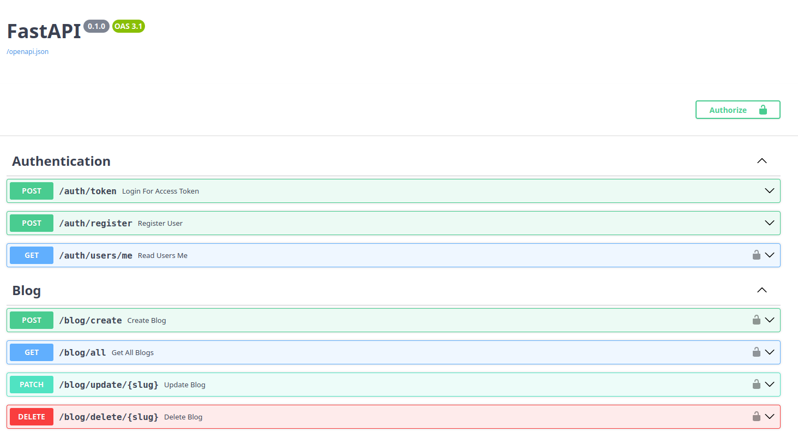

# BlogAPI

BlogAPI is a web application built with FastAPI that provides a RESTful API for managing blog posts. It utilizes MongoDB as the database and is containerized using Docker for easy deployment.

## Features

- **FastAPI**: A modern, fast (high-performance) web framework for building APIs with Python.
- **MongoDB**: A NoSQL database for storing blog posts.
- **Docker**: Containerization for both the application and the database, ensuring consistent environments across different systems.

## Screenshots


## API Endpoints


## Prerequisites

- **Docker**: Ensure that Docker is installed on your system. You can download it from the [official website](https://www.docker.com/products/docker-desktop).
- **Docker Compose**: This tool is used for defining and running multi-container Docker applications. It usually comes with Docker Desktop installations.

## Setup Instructions
- **User Registration**: `POST /auth/register`
- **User Token**: `POST /auth/token`
- **User Details**: `GET /auth/users/me`
- **User Update**: `PUT /auth/users/update`
- **Password Update**: `PUT /auth/users/changepassword`
- **Create Blog**: `POST /blog/create`
- **Get All Blogs**: `GET /blog/all`
- **Get Blog By Slug**: `GET /blog/{slug}`
- **Update Blog**: `PATCH /blog/{slug}`
- **Delete Blog**: `DELETE /blog/{slug}`

1. **Clone the Repository**:

   ```bash
   git clone https://github.com/santoshvandari/BlogAPI.git
   cd BlogAPI
   ```

2. **Build and Run**:

   Build the Docker images and start the services:

   ```bash
   docker-compose up --build
   ```

   This command will build the FastAPI application image and start both the application and MongoDB services.

2. **Access the Application**:

   Once the services are up and running, you can access the FastAPI application at [http://localhost:8000](http://localhost:8000). The automatically generated API documentation is available at [http://localhost:8000/docs](http://localhost:8000/docs).

   Note: Don't Forget to change the SECRET_KEY in utility.py file.


## References

- [FastAPI Documentation](https://fastapi.tiangolo.com/)
- [Docker Official Documentation](https://docs.docker.com/)
- [MongoDB Official Documentation](https://www.mongodb.com/docs/)


## Contributing
We welcome contributions! Feel free to submit a pull request or open an issue if you find bugs or want to add new features. Check out the [Contributing Guidelines](CONTRIBUTING.md) for more information.

## License
This project is licensed under the MIT License. See the [LICENSE](LICENSE) file for details.


